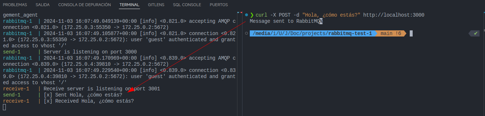

Este es un proyecto de prueba para probar el funcionamiento de RabbitMQ.

Para ejecutar el proyecto, sigue los siguientes pasos:

1. Ejecuta el Docker Compose:

```bash
docker compose up --build
```

2. Envia una petición al servidor send en `localhost:3000`:

```bash
    curl -X POST -d "Hola, ¿cómo estás?" http://localhost:3000
```

Puedes verificar el mensaje en la consola.

